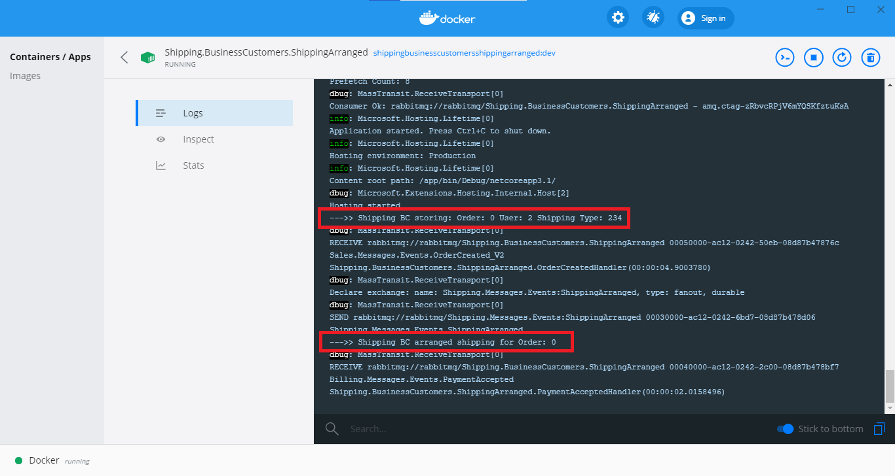

# A simple proof-of-concept project using MassTransit: Rewriting in .NET Core 3 the sample project of chapter 12 of PPPDDD (uses MassTransit with RabbitMQ, Razor Pages)

## References:

- Chapter 12 of ["Patterns, Principles, and Practices of Domain-Driven Design"](https://www.bookdepository.com/Patterns-Principles-Practices-Domain-Driven-Design-Scott-Millett/9781118714706?a_aid=jflaga) (PPPDDD) by Scott Millett
	- Uses .NET Framework 4.5, NServiceBus 4.3.3, MassTransit with MSMQ
	- Source code: https://github.com/elbandit/PPPDDD/tree/master/12%20-%20Integrating%20Via%20Messaging

- MassTransit documentation: [Configuration page](https://masstransit-project.com/usage/configuration.html)

## How to run using Docker Compose in Visual Studio 2019

1. Open `eCommerce.sln` in Visual Studio 2019

2. Set the project "docker-compose" as the startup project

3. Run

Then look at the logs in Docker Desktop's dashboard:

## How to run without using Docker

1. Download and install RabbitMQ: https://www.rabbitmq.com/download.html

2. Open `eCommerce.sln` in Visual Studio 2019

3. Set Multiple Startup Projects - right-click solution file in Visual Studio, then "Set Startup Projects..." (be sure to start the consumers first before starting the eCommerce.Web project)
	- Billing.Payments.PaymentAccepted
	- Sales.Orders.OrderCreated
	- Shipping.BusinessCustomers.ShippingArranged
	- **Last:** eCommerce.Web

4. Run in VS 2019

## Note about the use of static classes in this project, from page 199 of PPPDDD

> WARNING: Throughout this chapter [chapter 12] static classes and static variables are used because they are the simplest solution and allow the examples to remain focused on the relevant concepts. In a real application you should think very carefully about static methods and classes because they introduce tight‐coupling that can hinder code maintainability and testability. If you’re not familiar with dependency inversion, it is highly worthwhile learning. One good source is http://martinfowler.com/articles/dipInTheWild.html.
> 
> Some examples of static usages in this chapter that are not recommended for production applications are: `MvcApplication.Bus.Send()`, `Database. GetCardDetailsFor()`, and `PaymentProvider.ChargeCreditCard()`.